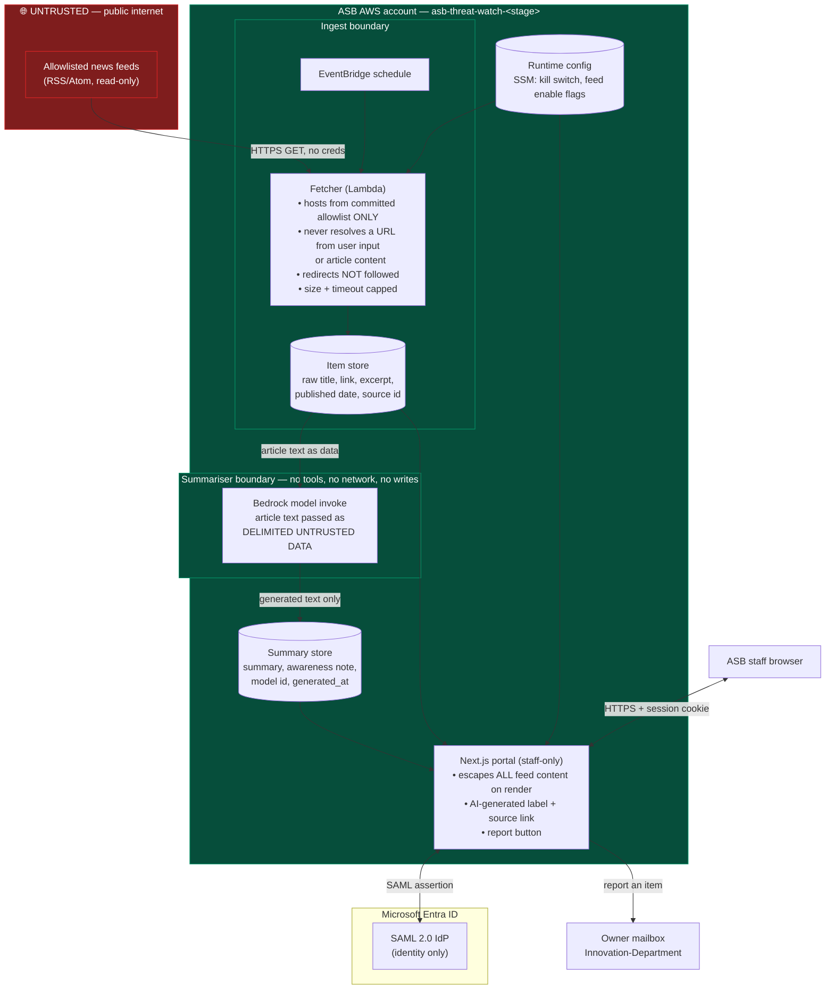

# Data flow — asb-threat-watch

Design-phase artifact required by `asb-secure-development` for the InfoSec
pre-design review. Status: **proposed, not built.**

The point of this diagram is to make one thing visible: where untrusted content
enters, and what it is allowed to touch after that.

## Trust boundaries

## What crosses each boundary

| # | Boundary crossing | Direction | Data | Control |
|---|---|---|---|---|
| 1 | Internet → Fetcher | in | RSS/Atom XML, article excerpt | Host allowlist (committed config); no redirect-following; response size cap; request timeout; no credentials sent |
| 2 | Item store → Summariser | in | Article title + excerpt | Passed as delimited untrusted **data**, never as instruction. Summariser has no tools, no network egress, no write permission |
| 3 | Summariser → Summary store | out | Generated summary + awareness note | Write performed by the calling function, not by the model. Model output is text only — never a URL to fetch, never a command |
| 4 | Stores → Portal | out | Item + summary rows | All feed-derived strings escaped at render. No `dangerouslySetInnerHTML` |
| 5 | Portal ↔ Entra | both | SAML AuthnRequest / signed assertion | `asb-entra-sso`; roles stay local, SAML authenticates identity only |
| 6 | Portal → Owner | out | Item id + reporter identity + reason | Rule 5 report button |
| 7 | Runtime config → Fetcher/Portal | in | Kill switch, per-feed enable flags | SSM Parameter Store; changeable without redeploy (rule 6) |

## What is deliberately absent

Stated explicitly because InfoSec will ask:

- **No customer, account, transaction, or T24 data.** No data-lake / Athena
  access, no credentials for either. The application has no code path to bank
  data.
- **No PII beyond staff identity.** The only personal data held is the staff
  email/name from the SAML assertion and, if an item is reported, who reported it.
- **No inbound path from article content to the fetcher.** Rule 2 exists because
  the reverse — letting a feed item name the next URL to fetch — would turn an
  allowlisted RSS feed into an SSRF primitive against the VPC and the instance
  metadata endpoint.
- **No user-supplied input reaches the model.** In this design staff read only;
  there is no "ask a question about this article" box. If one is ever added it
  becomes a new untrusted input and this document changes with it.
- **Not in PCI DSS scope** — no cardholder or payment data anywhere in the flow.
  To be confirmed by InfoSec, not assumed.

## Residual risks

| Risk | Mitigation | Residual |
|---|---|---|
| Prompt injection in an article steers the summary | Content-as-data framing; summariser has no tools/network/writes so a successful injection can only produce misleading *text* | Misleading text can still reach staff. Mitigated by the AI-generated label, the source link (rule 3), the report button (rule 5), and the kill switch (rule 6) |
| Staff treat the awareness note as an instruction | Rule 4 phrasing constraint ("worth checking whether we…") | Requires review of actual generated output during UAT, not just the prompt |
| A legitimate feed is compromised and serves hostile content | Allowlist limits *who*, not *what* | Kill switch drops to headline-and-link only; per-feed disable flag in runtime config |
| Model cost abuse | Summarisation is scheduled and bounded by feed volume, not user-triggered | Budget alarm + concurrency cap at deploy time |
