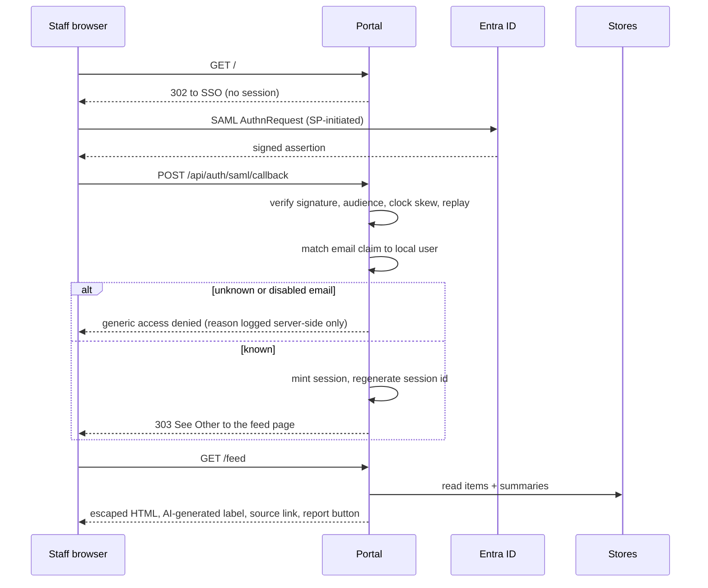

# Process flow — asb-threat-watch

Design-phase artifact required by `asb-secure-development`. Status: **proposed,
not built.**

## 1. Ingest cycle (scheduled, no human in the loop)

```mermaid
sequenceDiagram
    participant S as EventBridge
    participant F as Fetcher
    participant C as SSM runtime config
    participant W as Allowlisted feed
    participant D as Item store
    participant M as Bedrock summariser
    participant U as Summary store

    S->>F: scheduled trigger
    F->>C: read kill switch + per-feed flags
    alt kill switch ON
        F-->>S: fetch headlines only, skip summarisation
    else normal
        loop each ENABLED feed in committed allowlist
            F->>W: GET feed URL (no redirects, size cap, timeout)
            W-->>F: RSS/Atom XML
            F->>F: parse; drop items already seen (dedupe on guid+source)
            F->>F: validate item link host == the feed's allowlisted host
            F->>D: write raw item (title, link, excerpt, published, source_id)
        end
        loop each new item
            F->>M: invoke with article text as DELIMITED UNTRUSTED DATA
            M-->>F: summary + awareness note (text only)
            F->>F: reject output containing markup/URLs; flag on repeated failure
            F->>U: write summary (+ model id, generated_at)
        end
    end
```

Notes that matter for review:

- The **item link host is validated against the same allowlisted host** as the
  feed that produced it. Without this, an allowlisted feed could inject arbitrary
  `<link>` targets — rule 2's SSRF concern, one level deeper than the feed URL
  itself.
- The model's output is **never used as a URL, a command, or a fetch target.** It
  is stored as display text and nothing else.
- **The kill switch is read at the top of every cycle**, not at deploy time, so
  flipping the SSM parameter takes effect on the next run with no redeploy
  (rule 6).
- Failures are per-item, not per-cycle: one bad feed must not stop the others.
  An item with no summary displays as headline-and-link.

## 2. Staff read flow



Per `asb-entra-sso`: ACS redirect is **303**, not 302/307; the ACS path is exempt
from CSRF/same-origin gating because it is authenticated by the signed assertion;
`wantAuthnResponseSigned` stays **false** because Entra signs the assertion, not
the Response wrapper; replay protection uses a process-wide request-id cache.
Do not re-derive these — the skill has the full list of seven gotchas.

## 3. Report flow (rule 5)

1. Staff clicks **Report** on an item.
2. Portal captures item id, reporter identity from the session (not from the
   form), and an optional short reason.
3. Notification goes to the Innovation-Department owner mailbox.
4. Owner can disable the source via the per-feed runtime flag, or flip the kill
   switch, without a deploy.

State-changing, so it needs a CSRF token and per-user rate limiting.

## Open decision — SSO provisioning model

`asb-entra-sso` mandates **pre-provision only, no JIT**: an admin creates the
local user (email + role) before first login, and an unknown email is denied.

That is the right default for an app holding sensitive data. This app holds public
news, and its value depends on the whole department reading it casually — so
pre-provisioning every staff member is friction that will suppress the adoption
the project exists for.

Options for InfoSec to rule on:

| Option | Access gate | Trade-off |
|---|---|---|
| **A. Pre-provision only** (skill default) | Entra assignment **and** a local user row | Fully compliant; an admin must add each colleague before they can read |
| **B. Entra group as the gate** | Entra assignment only; local row created on first successful assertion, default role `reader` | Removes the friction; the gate becomes Entra group membership, managed by IT. A deviation from the skill — needs explicit InfoSec approval |

**Recommendation: raise B, implement A unless InfoSec approves B.** The skill says
these decisions are already made and not to re-litigate them, so this is not a
call to make in code. Either way, a local break-glass admin login stays reachable
at `/login?staff=1` so a SAML misconfiguration cannot lock everyone out.
